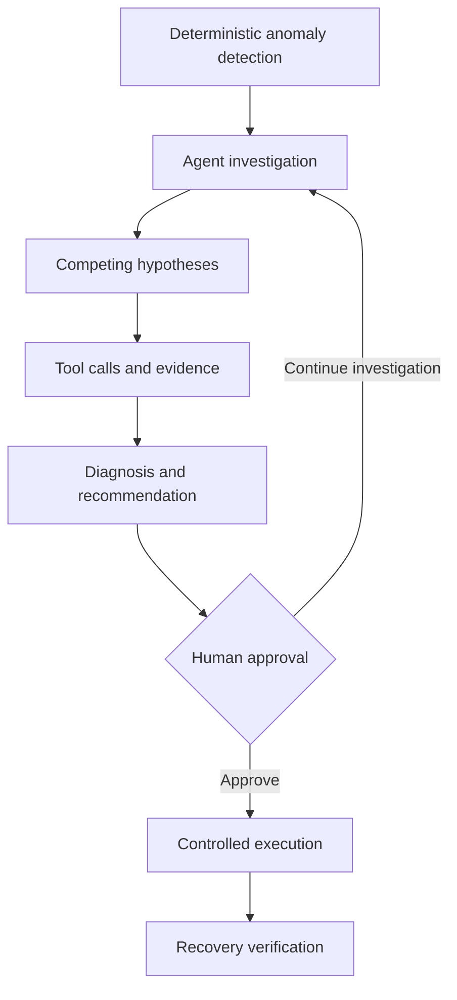
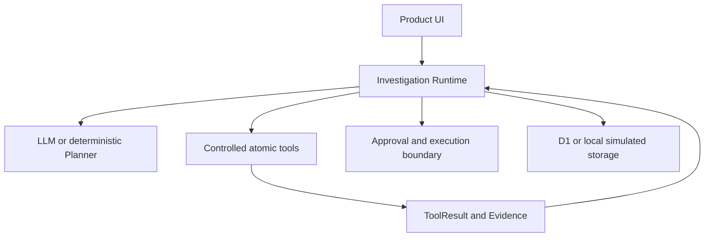

# ReleaseGuard AI

[简体中文](README.md) | English

[](https://github.com/Eason4real/releaseguard-ai/actions/workflows/ci.yml)
[](LICENSE)
[](https://www.typescriptlang.org/)
[](https://releaseguard.easonchao.com)

An auditable AI agent for post-release incident investigation. ReleaseGuard starts from anomalies in product metrics, maintains competing hypotheses, collects supporting and contradicting evidence through controlled tools, produces a traceable diagnosis, and keeps external write actions behind explicit human approval.

**[Live demo](https://releaseguard.easonchao.com)** · **[3-minute guided tour](https://releaseguard.easonchao.com/guided-experience)** · **[Full walkthrough](https://releaseguard.easonchao.com/best-practice)** · **[Evaluation](docs/EVALUATION.md)** · **[Agent architecture](docs/AGENT_ARCHITECTURE.md)**

## Why ReleaseGuard

When a business metric changes after a software release, product, engineering, and operations teams often investigate manually across monitoring, release metadata, logs, user feedback, and historical incidents. The difficult part is not merely finding related information; it is continuously answering:

- Is the anomaly related to this release?
- Which users, versions, platforms, or regions are affected?
- Which root-cause hypothesis best fits the available evidence?
- What supports the conclusion, and what contradicts it?
- Should the team observe, fix, roll back, or escalate?
- Did the product actually recover after an action?

ReleaseGuard organizes these questions into a stateful, auditable, and recoverable investigation workflow.



## Core capabilities

- **Deterministic risk detection:** Dynamic baselines, minimum sample sizes, and consecutive-window rules create risk events. The LLM investigates why; it does not invent anomalies.
- **Controlled Agent Loop:** The Planner returns structured decisions while the runtime owns tools, budgets, duplicate detection, retries, stopping conditions, and state transitions.
- **Competing hypotheses:** Multiple candidate causes remain active and are linked to `SUPPORTS`, `CONTRADICTS`, or `NEUTRAL` evidence.
- **Auditable evidence chain:** The runtime persists `ToolCall`, `ToolResult`, `Evidence`, `Diagnosis`, `ProposedAction`, `Approval`, and verification records.
- **Human-in-the-loop execution:** Read-only investigation tools may run autonomously. The implemented external write action, `CREATE_GITHUB_ISSUE`, requires server-side approval for one exact frozen argument set.
- **Historical incident retrieval:** Lexical, vector, and metadata signals can be combined. Similar incidents inform hypotheses but do not prove the current root cause.
- **Isolated public experience:** The public demo uses deterministic replay data, requires no credentials, and does not call a real model or external write API.

## System boundary



The public and private environments use the same product language and core domain model, but their runtime boundaries differ:

| Mode | Purpose | Data and external capabilities |
| --- | --- | --- |
| `PUBLIC_DEMO` | Frictionless product walkthrough | Browser replay data; shared state, real models, and external writes are disabled |
| `PRIVATE_LIVE` | Controlled real Agent execution | D1 persistence; configurable model and GitHub access; intended for one trusted operator |
| Local / CI | Development and regression testing | D1 simulation and deterministic retrieval fallback; never presented as hosted vector retrieval |

## Evaluation and reproducibility

The repository includes a 22-case investigation benchmark, a deterministic development harness, a semantic scorer, RAG retrieval evaluations, and runtime regression tests. Evaluation data and gold labels live under `eval/` and are excluded from Agent execution context.

The public evaluation focuses on:

| Metric family | Question |
| --- | --- |
| Root Cause Top-1 | Did the final diagnosis match the frozen root cause or correctly preserve uncertainty? |
| Evidence Precision | How many final citations are supporting evidence rather than distractors or unknown evidence? |
| Unsupported Claim Rate | How many factual diagnostic claims lack machine-verifiable evidence links? |
| Investigation Cost | How many model calls, tool calls, tokens, and milliseconds did the run consume? |
| Reliability | Are the workflow and result stable across repeated runs with the same input? |

See **[Evaluation](docs/EVALUATION.md)** for definitions, leakage controls, limitations, and reproduction commands. Public cases and offline simulations are never presented as private production data or measured human productivity gains.

## Quick start

### Requirements

- Node.js `>=22.13.0`
- npm
- Linux, WSL 2, or a compatible environment with Bash, `flock`, `curl`, and GNU `timeout`

### Run locally

```bash
git clone https://github.com/Eason4real/releaseguard-ai.git
cd releaseguard-ai
npm ci
cp .env.example .env
npm run dev
```

The recommended default is the isolated public mode:

```bash
RELEASEGUARD_DEPLOYMENT_MODE=PUBLIC_DEMO npm run dev
```

`PRIVATE_LIVE` requires the existing D1 schema plus model or GitHub credentials supplied securely through the runtime environment. Never commit real credentials.

## Verification

```bash
npm run tsc
npm run lint
npm test
npm run eval
npm run eval:investigation-dev-harness
```

Every push to `main` and every pull request targeting `main` runs type checking, linting, build verification, tests, and deterministic evaluations through [GitHub Actions](.github/workflows/ci.yml). Credential-dependent Live LLM evaluation remains separate from the deterministic CI gate.

## Repository structure

```text
app/                         Product pages and server API routes
lib/investigation/           Agent Loop, Planners, tools, evidence, approval, and state
lib/analytics/               Releases, metrics, and risk events
lib/risk-detection/          Deterministic anomaly detection
lib/retrieval/               Feedback and historical-incident hybrid retrieval
db/ + drizzle/               D1 schema, adapters, and ordered migrations
eval/                        Benchmarks, harnesses, scorers, fixtures, and results
tests/                       Runtime, approval, security-boundary, and page regressions
docs/                        Product, architecture, evaluation, and security documentation
worker/                      Cloudflare Worker entry point and bindings
```

## Technology

- Next.js `16.2.6`, React `19.2.6`, and TypeScript `5.9.3`
- Vinext, Vite, and Cloudflare Workers
- Drizzle ORM and Cloudflare D1
- Workers AI / Vectorize hosted retrieval, with an explicitly reported deterministic local fallback

## Security boundaries

- Public mode has no credential input surface and rejects shared-state, model, GitHub, and verification APIs on the server.
- LLM output cannot bypass server-side tool allowlists, argument validation, budgets, approval, or the state machine.
- Approval applies to one exact action and frozen argument set; it is not standing authorization for a class of actions.
- Hidden model chain-of-thought is neither stored nor displayed. Only public rationale, hypotheses, observations, and evidence references are persisted.
- Report security issues privately as described in [SECURITY.md](SECURITY.md). Do not place credentials or sensitive logs in public issues.

## Known limitations

- The public cases and Android 7.3.0 data are reproducible fixtures, not a production analytics integration.
- Automated post-fix verification is not yet integrated with real external systems; recovery verification in the public experience is replay data.
- The only implemented approval-protected external write action is `CREATE_GITHUB_ISSUE`.
- ReleaseGuard is not a general-purpose SRE agent and does not include a multi-tenant administration console, Slack/Jira integration, or autonomous production rollback.
- Live LLM results depend on the model and environment. Deterministic regression tests do not replace production validation.

## Documentation and community

- [Documentation index](docs/README.md)
- [Product specification](docs/PRODUCT_SPEC.md)
- [Agent architecture](docs/AGENT_ARCHITECTURE.md)
- [Evaluation](docs/EVALUATION.md)
- [Roadmap](ROADMAP.md)
- [Changelog](CHANGELOG.md)
- [Contributing](CONTRIBUTING.md)

Reproducible bug reports, evaluation cases, and design discussions are welcome through GitHub Issues. ReleaseGuard AI is available under the [MIT License](LICENSE).
