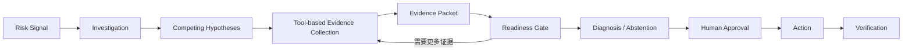

# ReleaseGuard AI

**面向产品与发布负责人的可审计调查 Agent：通过竞争假设、受控工具取证和人工审批，将发布异常转化为可追溯的诊断与处置流程。**

发布后业务指标异常时，指标、版本记录、用户反馈和历史事故往往分散在不同信息源中，团队也容易把“时间相关”直接判断成“发布导致”。ReleaseGuard AI 维护多个竞争假设，通过受控工具逐步收集支持与反驳证据；证据不足时继续调查或有界拒答，外部写操作则始终由服务端和人工审批控制。

[在线 Demo](https://releaseguard.easonchao.com) · [GitHub](https://github.com/Eason4real/releaseguard-ai) · [Final V8 Evaluation](evaluation/results/v8/portfolio-final-v8/investigation-live-benchmark-openai-compatible-0.2.0-2026-09-06T17-52-23-415Z-98a74e53a4a1-portfolio-v1-final-v8.md) · [Evaluation Methodology](docs/evaluation/methodology.md) · [Agent Architecture](docs/AGENT_ARCHITECTURE.md)

> 当前项目是使用合成、可复现数据构建的 Portfolio / Demo，不是企业生产部署。它聚焦发布风险调查，不是通用 SRE Agent、自动修复系统或自主回滚系统。

## 为什么做这个产品

- **信息分散：**一次发布调查需要同时理解业务指标、版本变化、用户反馈和历史事故。
- **相关不等于因果：**发布与异常同时发生，并不能单独证明发布导致异常。
- **LLM 解释不等于证据：**自然语言结论必须能追溯到实际工具结果。
- **模型不能直接执行外部动作：**权限、参数和审批必须由服务端掌控。
- **不确定性也是结果：**证据不足时应明确缺口并安全停止，而不是生成确定性根因。

## 产品如何工作



| 环节 | 产品职责 |
| --- | --- |
| Risk Signal | 用 baseline、最小样本量和连续窗口等确定性规则识别异常；LLM 不负责制造风险事件。 |
| Investigation | 创建可恢复的调查运行，持续保存预算、迭代和公开审计轨迹。 |
| Competing Hypotheses | 同时维护多个可能原因，以及各自的支持条件和反驳条件。 |
| Evidence Collection | 通过受控只读工具查询 release、metric、segment、feedback 和 historical incidents。 |
| Evidence Packet | 将 `ToolResult` 转换为带来源、范围、强度和 hypothesis relation 的结构化 Evidence。 |
| Readiness Gate | 判断应继续收集、形成因果诊断、输出有界假设，还是安全拒答。 |
| Diagnosis / Abstention | Synthesizer 只能基于 Evidence Packet 输出结论，并接受服务端 grounding 校验。 |
| Approval / Action | 当前唯一真实写操作是 `CREATE_GITHUB_ISSUE`，必须绑定冻结参数并获得人工批准。 |
| Verification | 动作完成后进入验证窗口，重新检查受影响指标、控制指标和必要反馈。 |

## 为什么不是“简单调用 LLM”

### 1. Evidence-first 可审计调查

`ToolResult`、`Evidence`、`Hypothesis` 和 `Diagnosis` 是独立的持久化对象。系统区分“工具返回了什么”和“该结果对当前假设意味着什么”，并保留 provenance、证据关系和公开调查轨迹。

### 2. Competing Hypotheses + Discriminator

系统不只寻找支持第一个猜测的证据。Planner 会维护竞争假设，并寻找能够区分发布回归、测量问题、外部依赖或流量结构等解释的正交查询；缺少 discriminator 时不能直接把相关性升级为因果。

### 3. Readiness + Bounded Abstention

Readiness Gate 区分 `NEEDS_COLLECTION`、`READY_FOR_CAUSAL`、`READY_FOR_BOUNDED_HYPOTHESIS` 和 `READY_FOR_ABSTENTION`。当工具或预算无法继续区分假设时，拒绝确定性归因是合法且可审计的产品结果。

### 4. Human Approval + Action + Verification

模型没有外部写权限。服务端校验 run、diagnosis、action、approval 和不可变 snapshot，通过幂等与重放保护执行获批动作；动作成功只代表变更已执行，后续仍需验证业务是否恢复。

### 5. Benchmark + Blind Judge + Failure Taxonomy

项目不通过几个成功 Demo 证明 Agent 有效。评测固定 dataset 和 Gold，保留失败运行，并分别检查 technical completion、evidence collection、citation、grounding 和 blind-judge result，再用 failure taxonomy 定位真实瓶颈。

## Portfolio v1.0 · Final V8 Benchmark

| 适合快速理解的事实 | 结果 |
| --- | ---: |
| 固定 DEV benchmark | 22 cases，单轮 |
| 至少收集一项 Gold key evidence | 22 / 22 |
| 收集完整 key-evidence set | 14 / 22 |
| 受控只读 investigation tool calls | 40 |

Final V8 使用 `gpt-5.6-sol`、temperature `0.1`、10 次 tool budget 和 16 次 max iterations。Gold 仅用于运行后的 scorer / judge，未进入 Agent runtime。

> Final V8 是基于合成、可复现 DEV dataset 的单轮 Portfolio benchmark，用于验证 Agent 调查与评测方法，不代表生产环境准确率。

<details>
<summary><strong>Evaluation Reality Check：完整结果与当前瓶颈</strong></summary>

| 指标 | Final V8 |
| --- | ---: |
| Technical PASS / FAIL | 11 / 11 |
| Terminal state `FINALIZED / INCONCLUSIVE / FAILED` | 1 / 10 / 11 |
| Strict Blind Judge | 2 / 22 |
| Lenient Blind Judge | 6 / 22 |
| 至少引用一项 key evidence | 1 / 22 |
| Grounded diagnosis | 1 / 22 |

11 个 technical failure 均由 `INVALID_LIMITATION_BOUNDARY` 引起，不是 provider 或网络故障。Final V8 表明 Collector 能在全部案例中取得至少一项关键证据，但 evidence citation、limitation contract 和 grounded synthesis 仍是明显瓶颈。这些数字描述 Portfolio benchmark 中的系统限制，不是生产业务准确率。

Blind Judge 的 `2 / 1 / 0 / N/A` 分布为 `2 / 4 / 15 / 1`。Judge 本身也是 LLM evaluator，因此结果需要结合 case trace 与评分理由理解。

</details>

原始依据：[Final report](evaluation/results/v8/portfolio-final-v8/investigation-live-benchmark-openai-compatible-0.2.0-2026-09-06T17-52-23-415Z-98a74e53a4a1-portfolio-v1-final-v8.json) · [Blind Judge summary](evaluation/results/v8/portfolio-final-v8/judge/summary.json) · [Dataset contract](docs/investigation-benchmark-evaluation-contract.md)

历史 V8 smoke 使用 `deepseek-v4-flash`，Portfolio Final V8 使用 `gpt-5.6-sol`。两阶段结果用于展示迭代路径和失败模式变化，不构成严格的同模型性能提升对比。历史材料见 [V8 smoke checkpoint](docs/evaluation/releaseguard-harness-v8-smoke-checkpoint.zh-CN.md)。

## What I learned building the Agent

```text
Agent 可以执行调查
→ 发现 technical success 不等于 evidence quality
→ 建立 Gold benchmark 与 Blind Judge
→ 用 failure taxonomy 定位 discriminator coverage
→ 引入 readiness 与 bounded abstention
→ 增加 narrow semantic repair
→ 注入 structured discriminator planning context
→ Final V8 暴露 limitation boundary、citation 与 grounded synthesis 问题
```

核心结论不是“每次改动都提高准确率”。部分 intervention 的价值在于阻止过早因果判断、保留部分证据、让失败有界，并把下一项产品瓶颈变得可观察、可分类、可验证。

## Demo 与运行边界

首页默认运行 `PUBLIC_DEMO`：无需登录或 API key，使用浏览器内的确定性 Demo / Replay 数据，不调用真实 LLM、GitHub 或 D1，也不会触发真实审批、回滚或外部写操作。

`PRIVATE_LIVE` 是面向单个受信、受访问控制操作者的运行路径。Hosted execution 使用 Cloudflare D1 保存状态；Workers AI 与 Vectorize 同时可用时提供 hosted semantic retrieval，本地与 CI 则使用明确标识的 deterministic fallback。两种 retrieval mode 不应混为一谈。

## Limitations

- Final V8 只有一轮 22-case DEV benchmark，未运行 multi-seed 或 `3×22`。
- 11 个案例因 `INVALID_LIMITATION_BOUNDARY` 中断；evidence collection 明显强于 citation 和 grounded synthesis。
- Planner 的 query selection 仍受单次 LLM 采样影响。
- Blind Judge 也是 LLM judge，可能存在语义标准和采样方差。
- Benchmark 与公开 Demo 使用合成、可复现 fixture，不是真实企业私有数据或生产流量。
- 当前真实写操作仅支持 `CREATE_GITHUB_ISSUE`；不支持自动修复、自动回滚或通用 remediation。
- Public Demo 是隔离的 Replay 体验，不证明企业生产部署效果、大规模稳定性或真实客户收益。

## 技术与安全边界

- Next.js、React、TypeScript、Drizzle ORM、Cloudflare Worker / D1。
- 一个 Investigation Agent，共享服务端 `AgentLoop`；没有 Multi-Agent orchestration。
- investigation tools 默认只读；外部写操作需要精确审批。
- 不保存私有 chain-of-thought，只保存公开 rationale、决策、Evidence 和审计事件。
- `.env*`、credentials、local database、build output 和 runtime report 不应提交到仓库。

## 本地运行

要求 Node.js `>=22.13.0`、npm，以及 Linux / WSL 环境中的 Bash、`flock`、`curl` 和 GNU `timeout`。

```bash
npm ci
cp .env.example .env
npm run dev
```

显式启动安全的公开模式：

```bash
RELEASEGUARD_DEPLOYMENT_MODE=PUBLIC_DEMO npm run dev
```

主要本地检查：

```bash
npm run tsc
npm run lint
npm test
npm run eval
```

## 深入阅读

- [Product Spec](docs/PRODUCT_SPEC.md)：产品定位、用户旅程和范围边界。
- [Agent Architecture](docs/AGENT_ARCHITECTURE.md)：运行时对象与职责设计；其中 suggested / future 内容不代表均已实现。
- [Phase 3 Requirements](docs/PHASE3_REQUIREMENTS.md)：当前架构约束与明确排除项。
- [Evaluation Methodology](docs/evaluation/methodology.md)：评测设计、评分和数据边界。
- [Investigation Benchmark Contract](docs/investigation-benchmark-evaluation-contract.md)：Gold、prediction 和 scorer contract。
- [V8 Improvement Plan](docs/evaluation/releaseguard-harness-v8-complete-improvement-plan.zh-CN.md)：历史研发方案，不是 Final 成绩声明。

## 部署说明

标准构建生成包含 Worker/API runtime 的 full-stack artifact；本项目不是纯静态导出。公开 Portfolio 部署必须使用 `PUBLIC_DEMO`，并保持 model、shared-state、GitHub 和 verification API 的服务端禁用边界。`PRIVATE_LIVE` 所需的模型、GitHub 和 hosted resource credentials 必须作为部署 secret 提供，不能提交到仓库。

GitHub Pages 无法执行该 Worker/API runtime，不适合作为完整部署目标。
