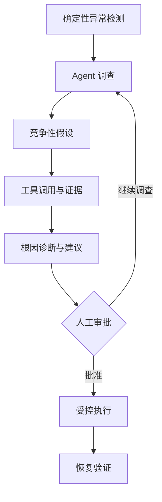
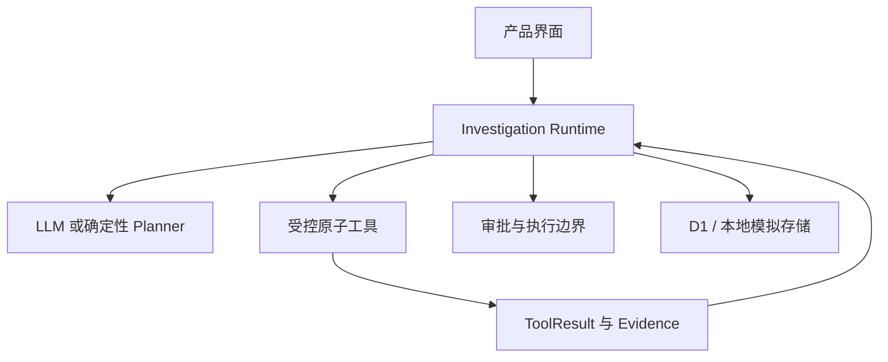

# ReleaseGuard AI

简体中文 | [English](README.en.md)

[](https://github.com/Eason4real/releaseguard-ai/actions/workflows/ci.yml)
[](LICENSE)
[](https://www.typescriptlang.org/)
[](https://releaseguard.easonchao.com)

面向软件版本上线后异常调查的可审计 AI Agent：从业务指标异常出发，维护竞争性假设，调用受控工具收集支持与反驳证据，形成可追溯诊断，并把外部写操作置于人工审批之后。

> An auditable AI agent for post-release incident investigation, evidence-based diagnosis, human approval, and recovery verification.

**[在线体验](https://releaseguard.easonchao.com)** · **[3 分钟引导](https://releaseguard.easonchao.com/guided-experience)** · **[完整案例](https://releaseguard.easonchao.com/best-practice)** · **[评测方法](docs/EVALUATION.zh-CN.md)** · **[系统架构（英文）](docs/AGENT_ARCHITECTURE.md)**

## 为什么做 ReleaseGuard

版本上线后出现业务指标异常时，产品、研发和运维通常需要跨监控、版本、日志、用户反馈与历史事故系统手动调查。困难不只是“找到一些相关信息”，而是持续回答：

- 异常是否与本次发布相关？
- 哪些用户、版本或地区受到影响？
- 哪个根因假设最符合现有证据？
- 哪些证据支持结论，哪些证据在反驳它？
- 当前应该观察、修复、回滚还是升级处理？
- 动作执行后，业务指标是否真正恢复？

ReleaseGuard 将这些问题组织为一条有状态、可审计、可恢复的调查链路。



## 核心能力

- **确定性风险检测**：基于动态基线、最小样本量和连续窗口规则创建风险事件；LLM 负责调查原因，不负责凭感觉制造异常。
- **受控 Agent Loop**：Planner 只能返回结构化决策，运行时统一管理工具、预算、重复调用、重试、停止条件和状态流转。
- **竞争性假设**：同时保留多个可能原因，并分别关联 `SUPPORTS`、`CONTRADICTS` 和 `NEUTRAL` 证据。
- **可审计证据链**：持久化 `ToolCall`、`ToolResult`、`Evidence`、`Diagnosis`、`ProposedAction`、`Approval` 与验证记录。
- **Human-in-the-loop**：只读调查工具可自主运行；已实现的外部写动作 `CREATE_GITHUB_ISSUE` 必须经过针对具体参数的服务端审批。
- **历史事故检索**：支持关键词、向量和元数据融合检索；相似事故只用于形成假设，不作为当前事故根因的直接证明。
- **公开隔离环境**：公开体验使用确定性 Replay 数据，不要求凭证，不调用真实模型或外部写接口。

## 系统边界



公开环境与私有运行环境使用相同的产品语言和核心领域模型，但运行边界不同：

| 模式 | 用途 | 数据与外部能力 |
| --- | --- | --- |
| `PUBLIC_DEMO` | 无门槛理解产品流程 | 浏览器内 Replay 数据；禁用共享状态、真实模型和外部写操作 |
| `PRIVATE_LIVE` | 受控的真实 Agent 运行 | D1 持久化；可配置模型与 GitHub；仅供受信任的单一操作者 |
| Local / CI | 开发与回归验证 | D1 模拟和确定性检索回退；不冒充托管向量检索 |

## 评测与可复现性

仓库包含一套 22 案例的调查 Benchmark、确定性开发 Harness、语义评分器、RAG 检索评测和运行时回归测试。评测数据与 Gold Label 位于 `eval/`，不会进入 Agent 执行上下文。

当前公开评测重点覆盖：

| 指标族 | 回答的问题 |
| --- | --- |
| Root Cause Top-1 | 最终诊断是否命中预先冻结的根因或正确选择保留结论 |
| Evidence Precision | 最终引用中有多少属于支持证据，而非干扰项或未知证据 |
| Unsupported Claim Rate | 事实性诊断中有多少缺少机器可核验的证据关联 |
| Investigation Cost | 实际模型调用、工具调用、Token与端到端耗时 |
| Reliability | 相同输入多次运行时，流程和结论是否稳定 |

具体定义、泄漏控制、已知限制和复现命令见 **[评测方法](docs/EVALUATION.zh-CN.md)**。公开案例和离线模拟结果不会被描述为企业生产数据或真实人工提效。

## 快速开始

### 环境要求

- Node.js `>=22.13.0`
- npm
- Linux、WSL 2，或具备 Bash、`flock`、`curl` 与 GNU `timeout` 的兼容环境

### 本地运行

```bash
git clone https://github.com/Eason4real/releaseguard-ai.git
cd releaseguard-ai
npm ci
cp .env.example .env
npm run dev
```

默认建议使用公开隔离模式：

```bash
RELEASEGUARD_DEPLOYMENT_MODE=PUBLIC_DEMO npm run dev
```

`PRIVATE_LIVE` 需要现有 D1 Schema，以及通过运行环境安全提供的模型或 GitHub 凭证。不要把真实密钥提交到仓库。

## 验证

```bash
npm run tsc
npm run lint
npm test
npm run eval
npm run eval:investigation-dev-harness
```

每次 Push 和 Pull Request 都会通过 [GitHub Actions](.github/workflows/ci.yml) 执行类型检查、Lint、构建、测试与确定性评测。需要外部模型凭证的 Live LLM Eval 与确定性 CI Gate 分开运行。

## 项目结构

```text
app/                         产品页面与服务端 API Routes
lib/investigation/           Agent Loop、Planner、工具、证据、审批与状态机
lib/analytics/               发布、指标与风险事件
lib/risk-detection/          确定性异常检测
lib/retrieval/               反馈与历史事故混合检索
db/ + drizzle/               D1 Schema、适配器与有序迁移
eval/                        Benchmark、Harness、Scorer、Fixture 与结果
tests/                       运行时、审批、安全边界与页面回归测试
docs/                        产品、架构、评测与安全文档
worker/                      Cloudflare Worker 入口与绑定
```

## 技术栈

- Next.js `16.2.6`、React `19.2.6`、TypeScript `5.9.3`
- Vinext、Vite 与 Cloudflare Worker
- Drizzle ORM 与 Cloudflare D1
- Workers AI / Vectorize 托管检索路径，以及显式标记的本地确定性回退

## 安全边界

- 公开模式没有凭证输入入口，并由服务端拒绝共享状态、模型、GitHub和验证 API。
- LLM输出不能绕过服务端工具白名单、参数校验、预算、审批和状态机。
- 审批只绑定一次具体动作及其冻结参数，不代表对某类动作的长期授权。
- 不保存或展示隐藏的模型思维链，只保存面向用户的理由、假设、观察和证据引用。
- 安全问题请按 [SECURITY.zh-CN.md](SECURITY.zh-CN.md) 中的方式私下报告，不要在公开 Issue 中提交密钥或敏感日志。

## 已知限制

- 当前公开案例与 Android 7.3.0 数据是可复现 Fixture，不是生产分析系统接入。
- 自动化修复后重验证尚未完整接入真实外部系统；公开体验中的恢复验证属于 Replay。
- 当前只实现一个受审批保护的外部写动作：`CREATE_GITHUB_ISSUE`。
- 项目不是通用 SRE Agent，也不包含多租户企业后台、Slack/Jira集成或自主生产回滚。
- Live LLM结果受模型和运行环境影响；确定性回归测试不能替代真实生产验证。

## 文档与参与

- [文档导航](docs/README.zh-CN.md)
- [产品规格（英文）](docs/PRODUCT_SPEC.md)
- [Agent 架构（英文）](docs/AGENT_ARCHITECTURE.md)
- [评测方法](docs/EVALUATION.zh-CN.md)
- [路线图](ROADMAP.zh-CN.md)
- [变更记录](CHANGELOG.zh-CN.md)
- [贡献指南](CONTRIBUTING.zh-CN.md)

欢迎通过 Issue 提交可复现的问题、评测案例或设计讨论。项目采用 [MIT License](LICENSE)。
